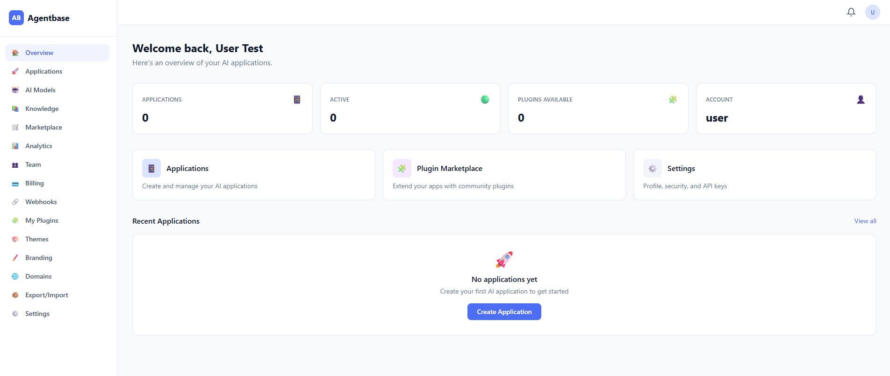

# Agentbase

**Similar to WordPress, made for AI Native Applications** — Build, deploy, and manage AI-powered applications without the complexity.

Agentbase is an open-source platform that brings the WordPress model to AI development: plugins, themes, a marketplace, and a hosted option — everything you need to launch AI products fast.

[](https://www.gnu.org/licenses/gpl-3.0)
[](https://pnpm.io/)
[](https://agentaflow.github.io/agentbase)

> 📖 **Full documentation is available at [agentaflow.github.io/agentbase](https://agentaflow.github.io/agentbase)**
> — covering self-hosting, plugin & theme development, AI model configuration, and the full API reference.

## Screenshots

<p align="center">
  
</p>
<p align="center"><em>AI-Native — Built from the ground up for AI-first applications</em></p>

<p align="center">
  
</p>
<p align="center"><em>Application Dashboard — Managing AI applications, plugins, and configurations</em></p>

<p align="center">
  
</p>
<p align="center"><em>Chat Application — Fully functional AI chat app powered by your chosen model</em></p>

<p align="center">
  
</p>
<p align="center"><em>Create Application — Quickly scaffold and configure a new AI application</em></p>

## Architecture

```
agentbase/
├── packages/
│   ├── core/              # NestJS API (PostgreSQL + MongoDB)
│   ├── frontend/          # Next.js 14 (App Router + Tailwind)
│   ├── ai-service/        # FastAPI (AI provider integrations + SSE streaming)
│   ├── installer/         # Self-hosted CLI installer (Commander + Inquirer)
│   ├── shared/            # Shared TypeScript types
│   ├── plugins/           # Plugin SDK + examples
│   └── themes/            # Theme SDK + starter themes
├── docs/                  # Documentation site (Nextra)
├── docker-compose.yml     # Local dev databases
├── docker-compose.prod.yml # Production stack
└── .env.example           # Environment template
```

## Tech Stack

| Layer              | Technology                                    |
| ------------------ | --------------------------------------------- |
| **Core API**       | Node.js + NestJS + TypeORM                    |
| **Frontend**       | Next.js 14 + React + Tailwind CSS             |
| **AI Service**     | Python + FastAPI                              |
| **SQL Database**   | PostgreSQL 16                                 |
| **Document DB**    | MongoDB 7                                     |
| **Cache**          | Redis 7                                       |
| **Infrastructure** | Docker, Nginx, DigitalOcean Kubernetes (DOKS) |
| **License**        | GPL-3.0                                       |

## Quick Start

### Prerequisites

- Node.js 20+
- Python 3.11+
- Docker & Docker Compose
- pnpm 9+

### Setup

```bash
# Clone the repo
git clone https://github.com/agentaflow/agentbase.git
cd agentbase

# Copy environment variables
cp .env.example .env

# Start databases
docker compose up -d

# Install dependencies
pnpm install

# Start all services
pnpm dev
```

Services will be available at:

- **Frontend**: http://localhost:3000
- **Core API**: http://localhost:3001
- **API Docs**: http://localhost:3001/api/docs
- **AI Service**: http://localhost:8000

### Start Individual Services

```bash
pnpm dev:core       # NestJS API only
pnpm dev:frontend   # Next.js frontend only
pnpm dev:ai         # FastAPI AI service only
```

### Self-Hosted Installation

For production self-hosted deployments, use the CLI installer:

```bash
cd packages/installer
pnpm install
npx ts-node src/cli.ts check     # Verify system requirements
npx ts-node src/cli.ts install   # Interactive installation wizard
npx ts-node src/cli.ts status    # Check service status
npx ts-node src/cli.ts update    # Update to latest version
```

## Features

### 🤖 AI Integration

- **Multi-Provider Support** — OpenAI (GPT-4, GPT-4o, GPT-3.5), Anthropic (Claude), Google Gemini (2.0 Flash, 1.5 Pro, 1.5 Flash), HuggingFace (Inference API)
- **Model Configuration Dashboard** — Per-app model configs with provider selection, parameter tuning (temperature, max tokens, top-p), and system prompts
- **A/B Testing** — Model config versioning with traffic splitting and performance metrics tracking
- **Streaming Responses** — Server-Sent Events (SSE) for real-time token-by-token output
- **Conversation Management** — Create, continue, archive conversations per application
- **Prompt Templates** — Reusable templates with `{{variable}}` substitution
- **Knowledge Base (RAG)** — Vector-based semantic search with OpenAI embeddings, document chunking, and context retrieval

### 🔌 Plugin System

- **WordPress-Style Hooks** — Actions and filters with priority-based execution
- **Plugin SDK** — TypeScript interfaces and utilities for plugin development
- **Advanced Capabilities** — Database access (scoped key-value store), custom API endpoints, cron scheduling, webhooks, admin UI extensions, inter-plugin event bus
- **Lifecycle Management** — Install, activate, deactivate, uninstall with dependency resolution
- **Marketplace** — Browse, search, rate, and review plugins and themes with 8 categories
- **Plugin Versioning** — Multiple versions per plugin with changelogs, compatibility checks, and checksums
- **Developer Portal** — Submit plugins/themes for marketplace review, admin approval workflow
- **Download Tracking** — Automatic install/download counters
- **Per-App Installation** — Install and configure plugins independently per application

### 🎨 Themes & Customization

- **Theme Engine** — CSS custom property generation with 4 built-in presets
- **White-Label Branding** — Custom colors, fonts, logos, email templates, and CSS injection
- **Custom Domains** — DNS verification (CNAME/TXT), SSL tracking, domain settings
- **Embeddable Widget** — Standalone JavaScript widget for any website with theme support

### 👥 Teams & Collaboration

- **Organizations** — Team creation with member management (Owner/Admin/Member/Viewer roles)
- **SSO Integration** — SAML 2.0 and OIDC support with auto-provisioning
- **Notifications** — In-app notification system with real-time updates
- **Audit Logging** — Comprehensive audit trail for all platform actions

### 💳 Billing & Subscriptions

- **Stripe Integration** — 4 subscription tiers (Free, Starter $29/mo, Pro $99/mo, Enterprise $499/mo)
- **Usage Metering** — Token and message quotas with enforcement before AI calls
- **Webhooks** — 11 event types with HMAC-SHA256 signing and delivery tracking
- **Data Export/Import** — JSON and CSV export, bulk import with error handling

### 🔐 Authentication & Security

- **OAuth2** — GitHub and Google OAuth with automatic account linking
- **JWT + Refresh Tokens** — Secure authentication with token rotation
- **API Keys** — Create, scope, rate-limit, and revoke API keys per application
- **Role-Based Access Control** — Admin, Developer, User roles with permission guards
- **Security Hardening** — Helmet middleware, CORS, rate limiting, HSTS, CSP headers

### 📊 Analytics & Monitoring

- **Usage Analytics** — Track conversations, messages, tokens, costs per application
- **Event Tracking** — MongoDB-backed event stream (message_sent, widget_loaded, api_call, error)
- **System Health** — Real-time service checks (PostgreSQL, MongoDB, Redis, AI Service)
- **Platform Statistics** — Users, applications, subscriptions, resource usage

### 🚀 Deployment & Self-Hosting

- **Self-Hosted Installer CLI** — Interactive installation wizard (`agentbase install`) with system requirements checking, database setup, admin account creation, and `.env` generation
- **Update Mechanism** — `agentbase update` with automatic backups, migration running, and dependency updates
- **System Status** — `agentbase status` shows version, service health, and Docker container status
- **Docker Production Stack** — Multi-stage builds with Alpine images, health checks, non-root user
- **Nginx Reverse Proxy** — SSL termination, rate limiting, security headers, SSE streaming
- **Email Service** — SMTP transport with HTML templates (welcome, password reset, usage warnings)
- **File Uploads** — S3-compatible storage (AWS S3, MinIO, DigitalOcean Spaces, Cloudflare R2)
- **Automated Backups** — PostgreSQL and MongoDB backup scripts with 7-day retention

### 📖 Documentation

- **Self-Hosting Guide** — Complete installation and configuration instructions
- **Plugin Development** — Getting started, SDK reference, advanced capabilities, publishing guide
- **AI Models Guide** — Provider configuration, model settings, A/B testing
- **API Reference** — Full marketplace and model configs API documentation
- **Examples Gallery** — AI chatbot, plugin with database, custom theme, embeddable widget, RAG pipeline

## API Endpoints

### Authentication

- `POST /api/auth/register` — Register new user
- `POST /api/auth/login` — Login
- `GET /api/auth/me` — Get current user
- `GET /api/auth/github` — OAuth: Redirect to GitHub
- `GET /api/auth/github/callback` — OAuth: GitHub callback
- `GET /api/auth/google` — OAuth: Redirect to Google
- `GET /api/auth/google/callback` — OAuth: Google callback
- `GET /api/auth/providers` — List available OAuth providers
- `POST /api/auth/change-password` — Change password
- `POST /api/auth/password-reset/request` — Request password reset

### Applications

- `POST /api/applications` — Create application
- `GET /api/applications` — List user's applications
- `GET /api/applications/:id` — Get application
- `PUT /api/applications/:id` — Update application
- `DELETE /api/applications/:id` — Delete application

### Plugins

- `GET /api/plugins` — List marketplace plugins
- `POST /api/plugins` — Create plugin
- `PUT /api/plugins/:id/publish` — Publish plugin
- `POST /api/applications/:appId/plugins` — Install plugin
- `PUT /api/applications/:appId/plugins/:id/activate` — Activate plugin
- `PUT /api/applications/:appId/plugins/:id/deactivate` — Deactivate plugin
- `DELETE /api/applications/:appId/plugins/:id` — Uninstall plugin
- `ALL /api/plugins/:pluginId/endpoints/*` — Dynamic plugin custom endpoints

### Marketplace

- `GET /api/marketplace/plugins/browse` — Browse plugins
- `GET /api/marketplace/plugins/featured` — Featured plugins
- `GET /api/marketplace/plugins/categories` — Plugin categories
- `GET /api/marketplace/plugins/:id` — Plugin detail with rating stats
- `GET /api/marketplace/plugins/:id/reviews` — Plugin reviews
- `POST /api/marketplace/plugins/:id/reviews` — Submit review
- `GET /api/marketplace/plugins/:id/versions` — Plugin versions
- `POST /api/marketplace/plugins/:id/versions` — Publish new version
- `GET /api/marketplace/themes/browse` — Browse themes
- `GET /api/marketplace/themes/featured` — Featured themes
- `GET /api/marketplace/themes/:id` — Theme detail
- `GET /api/marketplace/themes/:id/reviews` — Theme reviews
- `POST /api/marketplace/themes/:id/reviews` — Submit theme review
- `POST /api/marketplace/submit/plugin` — Developer: submit plugin
- `POST /api/marketplace/submit/theme` — Developer: submit theme
- `GET /api/marketplace/admin/plugins/pending` — Admin: pending plugins
- `POST /api/marketplace/admin/plugins/:id/approve` — Admin: approve plugin
- `POST /api/marketplace/admin/plugins/:id/reject` — Admin: reject plugin
- `GET /api/marketplace/admin/themes/pending` — Admin: pending themes
- `POST /api/marketplace/admin/themes/:id/approve` — Admin: approve theme
- `POST /api/marketplace/admin/themes/:id/reject` — Admin: reject theme

### Model Configs

- `GET /api/model-configs?applicationId=` — List model configs
- `POST /api/model-configs` — Create model config
- `GET /api/model-configs/:id` — Get model config
- `PUT /api/model-configs/:id` — Update model config
- `DELETE /api/model-configs/:id` — Delete model config
- `PATCH /api/model-configs/:id/default` — Set default model
- `GET /api/model-configs/:id/versions` — List A/B test versions
- `POST /api/model-configs/:id/versions` — Create A/B test version

### Prompt Templates

- `POST /api/prompts` — Create prompt template
- `GET /api/prompts?applicationId=` — List templates for app
- `GET /api/prompts/:id` — Get prompt template
- `PUT /api/prompts/:id` — Update prompt template
- `DELETE /api/prompts/:id` — Delete prompt template
- `PUT /api/prompts/:id/default` — Set as default template
- `POST /api/prompts/render` — Render template with variables

### Themes

- `GET /api/themes` — List themes
- `POST /api/themes` — Create theme
- `PUT /api/applications/:id/theme` — Set application theme
- `PUT /api/applications/:id/theme/customize` — Customize theme

### AI Service

- `GET /api/ai/providers` — List AI providers
- `POST /api/ai/conversations` — Create conversation
- `POST /api/ai/conversations/:id/messages` — Send message (standard)
- `POST /api/ai/conversations/:id/stream` — Send message (SSE streaming)
- `GET /api/ai/conversations/by-app/:appId` — List conversations
- `DELETE /api/ai/conversations/:id` — Archive conversation

## AI Providers

Agentbase supports multiple AI providers out of the box:

- **OpenAI** — GPT-4, GPT-4o, GPT-3.5 Turbo
- **Anthropic** — Claude Sonnet 4.5, Claude Haiku 4.5
- **Google Gemini** — Gemini 2.0 Flash, Gemini 1.5 Pro, Gemini 1.5 Flash
- **HuggingFace** — Any model via the Inference API (Mistral, Llama, Falcon, etc.)

Set your API keys in `.env` and Agentbase handles provider routing, rate limiting, and conversation management automatically.

## Changelog

See [CHANGELOG.md](CHANGELOG.md) for a detailed history of changes across all phases.

## Contributing

See [CONTRIBUTING.md](CONTRIBUTING.md) for development guidelines.

## License

GNU General Public License v3.0 — see [LICENSE](LICENSE)

Built by [AgentaFlow](https://www.agentaflow.com)
