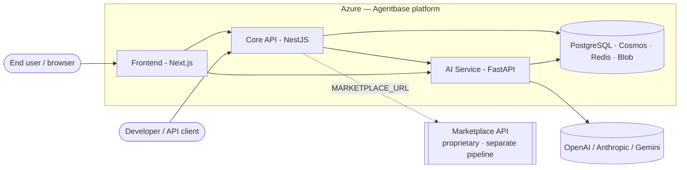
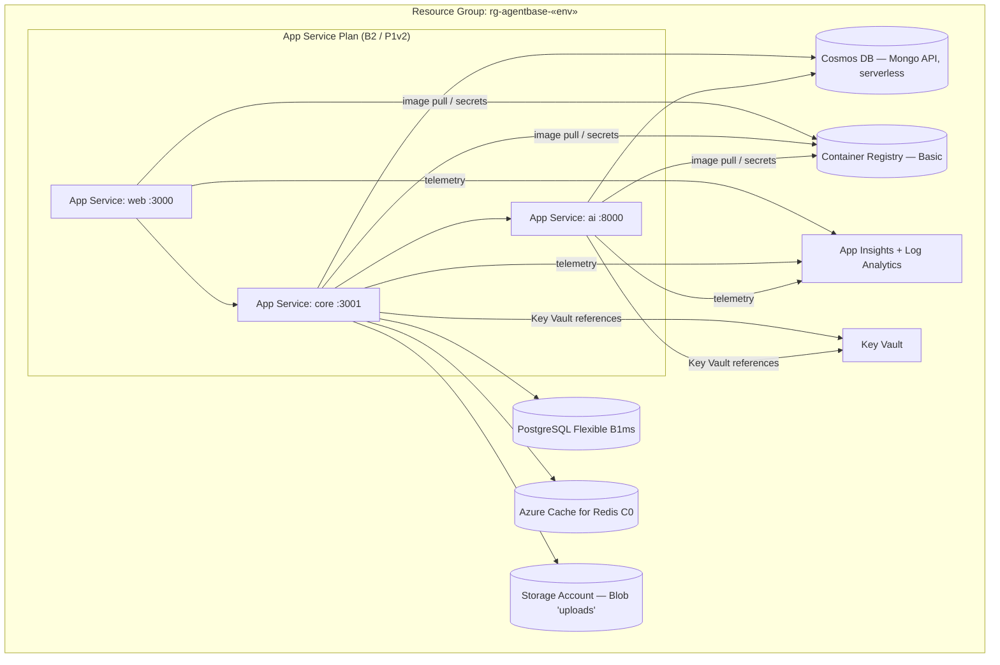
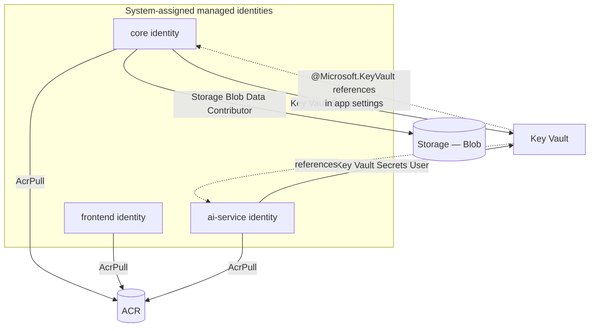
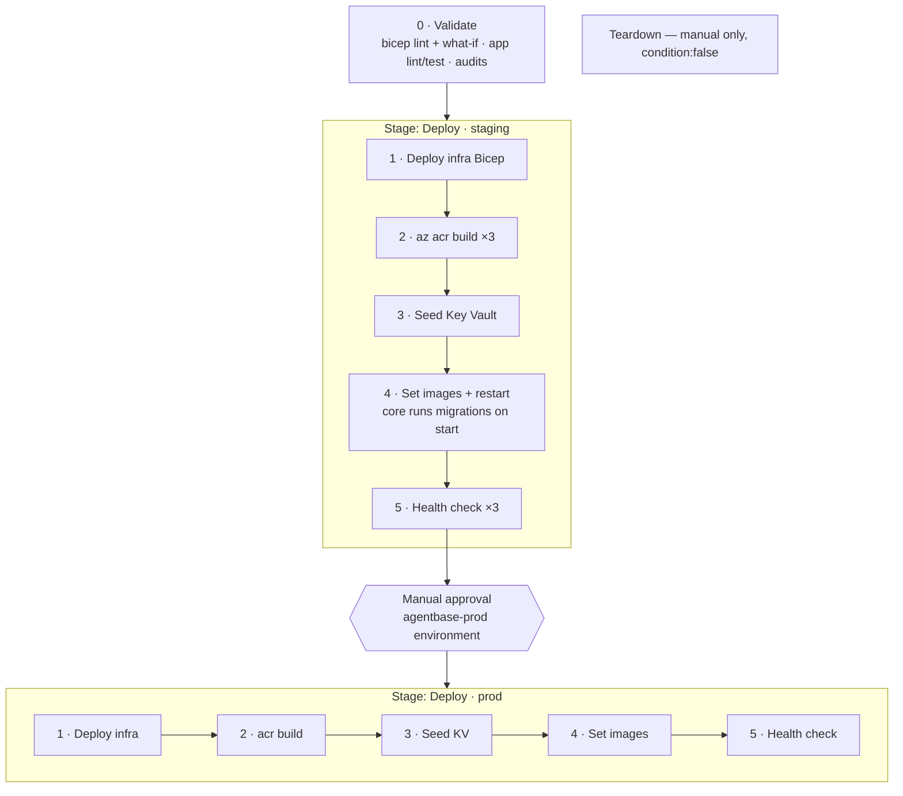
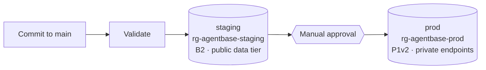

# Agentbase on Azure — Architecture

> Work item 6 — *Architect and align the full application with Bicep.*
> This document describes the target Azure architecture for the **Agentbase core
> platform** and how the Bicep IaC (`infra/`) and the `agentbase-deploy.yml`
> pipeline realise it. The **Marketplace** is a separate, proprietary service
> deployed by its own pipeline (a later work item); it is shown here for context
> but is **not** provisioned by this template.

---

## 1. What gets deployed

The Agentbase core platform is three independently deployable services, each
already containerised (Dockerfiles under `packages/*/Dockerfile`):

| Service | Tech | Container port | Health endpoint |
|---------|------|----------------|-----------------|
| `frontend` | Next.js 14 (standalone) | 3000 | `/` |
| `core` | NestJS API | 3001 | `/api/health` |
| `ai-service` | Python FastAPI (uvicorn) | 8000 | `/api/ai/health` |

They run as **Linux container App Services** on a shared plan, pulling images
from **Azure Container Registry** via managed identity, backed by managed data
services, with all secrets in **Key Vault** and telemetry in **Application
Insights**.

### Azure resources (per environment)

| Resource | Module | SKU | Notes |
|----------|--------|-----|-------|
| App Service Plan (Linux) | `app-service-plan.bicep` | B2 (staging) / P1v2 (prod) | Hosts all 3 apps |
| App Service ×3 | `app-service-container.bicep` | — | System-assigned identity, HTTPS-only |
| Container Registry | `container-registry.bicep` | Basic | Admin user disabled |
| PostgreSQL Flexible Server | `postgres-flexible.bicep` | Burstable B1ms | TypeORM/`pg`; TLS enforced |
| Cosmos DB (Mongo API) | `cosmos-mongo.bicep` | Serverless | Mongoose; pay-per-request |
| Azure Cache for Redis | `redis-cache.bicep` | Basic C0 | TLS-only (6380) |
| Storage Account (Blob) | `storage-account.bicep` | Standard LRS | Uploads; no shared keys |
| Key Vault | `key-vault.bicep` | Standard | RBAC; managed-identity access |
| Log Analytics + App Insights | `monitoring.bicep` | PAYG | Daily ingestion cap |
| VNet + Private Endpoints | `networking.bicep` | — | **prod only** — data tier off public net |

Composition root: [`infra/main.bicep`](../../infra/main.bicep). Per-environment
inputs: `infra/main.parameters.staging.json`, `infra/main.parameters.prod.json`.

---

## 2. System context



The core platform connects to the Marketplace over `MARKETPLACE_URL` (dashed —
deployed and owned separately). LLM providers are reached from the AI service.

---

## 3. Azure resource topology



In **prod**, `networking.bicep` adds a VNet (app-integration subnet + private-
endpoint subnet), private endpoints for PostgreSQL, Cosmos, Redis, Blob and Key
Vault, and the matching private DNS zones — so the data tier has **no public
network access** (constitution Principle II). In **staging**, the data services
keep public access with an "allow Azure services" firewall rule to minimise cost
and complexity.

---

## 4. Security & identity model



Principles applied:

- **No secrets in source or Bicep.** `postgresAdminPassword` is a `@secure()`
  parameter supplied by the pipeline from a masked variable group. All app
  secrets live in Key Vault and are consumed through App Service **Key Vault
  references** (`@Microsoft.KeyVault(SecretUri=…)`), resolved by each app's
  managed identity.
- **Least privilege RBAC.** Each identity gets only what it needs:
  `frontend` → `AcrPull` only (no secrets); `ai-service` → `AcrPull` +
  `Key Vault Secrets User`; `core` → those plus `Storage Blob Data Contributor`.
  No `Owner`/`Contributor` on data resources.
- **No registry/storage keys.** ACR admin user is disabled; Storage disables
  shared-key access — both use managed identity. Uploads use the Blob SDK with
  `DefaultAzureCredential` (see `packages/core/src/modules/uploads/uploads.service.ts`).
- **TLS everywhere.** App Services are HTTPS-only (TLS 1.2 min); PostgreSQL and
  Redis enforce TLS; Cosmos requires TLS via its connection string.
- **Public access off by default in prod** via private endpoints.

### Secret inventory (Key Vault → app setting)

| Key Vault secret | App setting (env var) | Consumed by | Source |
|------------------|-----------------------|-------------|--------|
| `postgres-password` | `POSTGRES_PASSWORD` | core | variable group |
| `mongo-uri` | `MONGO_URI` | core, ai | `az cosmosdb keys list` |
| `redis-password` | `REDIS_PASSWORD` | core¹ | `az redis list-keys` |
| `jwt-secret`, `jwt-refresh-secret` | `JWT_SECRET`, `JWT_REFRESH_SECRET` | core | generated once |
| `encryption-key`, `plugin-settings-encryption-key` | same (upper-snake) | core | generated once |
| `stripe-secret-key`, `stripe-webhook-secret` | `STRIPE_*` | core | variable group (optional) |
| `openai-api-key`, `anthropic-api-key`, `gemini-api-key` | `*_API_KEY` | ai | variable group (optional) |

¹ Redis settings are injected and ready; the core's rate limiter is currently
in-memory (`common/interceptors/rate-limit.interceptor.ts`). Swapping it for a
Redis-backed limiter needs no infra change — `REDIS_HOST/PORT/TLS/PASSWORD` are
already present. Secrets are seeded idempotently by
[`azure-pipelines/scripts/seed-keyvault.sh`](../../azure-pipelines/scripts/seed-keyvault.sh).

---

## 5. CI/CD pipeline flow



Notes:

- **Order matters.** Infrastructure is deployed *first* so the registry exists,
  then `az acr build` builds and pushes the three images server-side, then the
  apps are pointed at the new tag and restarted. The very first run creates the
  apps before the image exists; they go healthy once step 4 restarts them.
- **Idempotent.** `az deployment group create --mode Incremental` with
  deterministic names — re-runs converge, never duplicate. `what-if` in Validate
  previews changes.
- **Promotion.** Both environments build from the same commit; prod is identical
  source. (A bit-identical `az acr import` promotion is a documented enhancement.)
- **Migrations** run on core startup (`RUN_MIGRATIONS=true`) so they execute
  inside Azure — important for prod, whose database is private and unreachable
  from the pipeline agent.
- **Rollback.** Re-point an app at the previous image tag and restart:
  `az webapp config container set --name <app> -g <rg> --container-image-name <acr>/<repo>:<previousBuildId>`.
  (Blue-green slot swaps need Standard S1+; see [pipeline.md](pipeline.md).)

See [`pipeline.md`](pipeline.md) for the full runbook and one-time setup.

---

## 6. Environment promotion



| | Staging | Prod |
|---|---------|------|
| App Service Plan | B2 | P1v2 |
| Data-tier network | Public + firewall | Private endpoints (VNet) |
| Approval | Automatic | Manual gate |
| Parameter file | `main.parameters.staging.json` | `main.parameters.prod.json` |

---

## 7. Constitution alignment

The [agentbase-azure constitution](https://github.com/AgentaFlow/agentbase-azure)
governs Azure work. This deployment honours:

| Principle | How |
|-----------|-----|
| I — IaC always | Every resource in `infra/`; no portal changes |
| II — Security by default | Managed identity, Key Vault refs, least-priv RBAC, private endpoints (prod), TLS, no shared keys |
| III — Modular Bicep | One module per service; `main.bicep` is the sole entry point; the app module + env template are reused, not copied |
| IV — Automated validation | `agentbase-deploy.yml` runs bicep lint → what-if → tests → audits before deploy |
| V — Cost design | **Deviation (approved):** low-cost paid SKUs instead of free tier — see [cost.md](cost.md) |

---

## 8. Application wiring for Azure

Minimal, additive changes let the real platform run on Azure (all gated, so
local/dev and tests are unaffected):

- **PostgreSQL TLS** — `app.module.ts` and `data-source.ts` enable `ssl` when
  `POSTGRES_SSL=true` (Azure requires TLS).
- **Blob uploads** — `uploads.service.ts` gains an Azure Blob backend using
  `DefaultAzureCredential` (managed identity), selected when
  `AZURE_STORAGE_ACCOUNT` is set; otherwise the existing S3/local paths apply.
- **Build fix** — `packages/core/tsconfig.json` now includes the `multer` types
  so `nest build` (and therefore the container image) compiles. *(Pre-existing
  break: CI only ran core tests, never `nest build`.)*
- **Mongo/Redis** — no code change: Mongo TLS comes from the Cosmos connection
  string; Redis settings are injected for future use.
```
